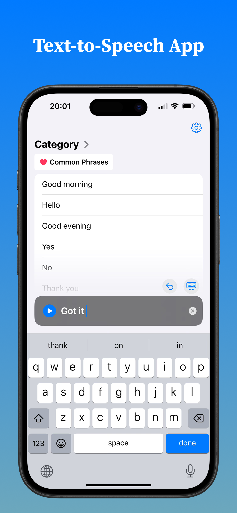
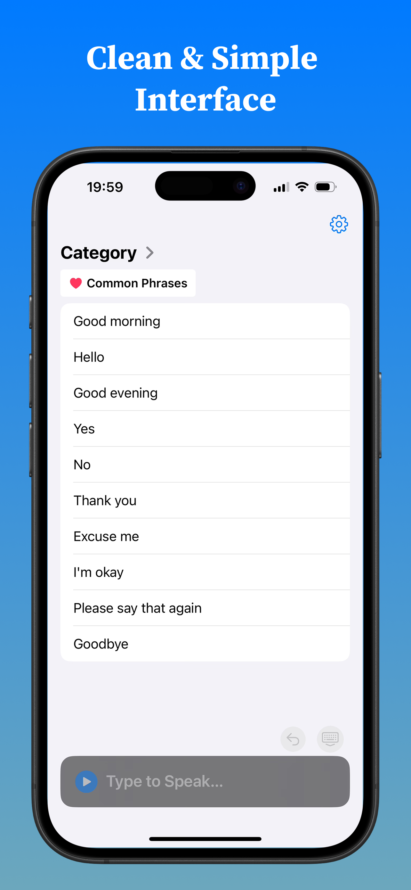
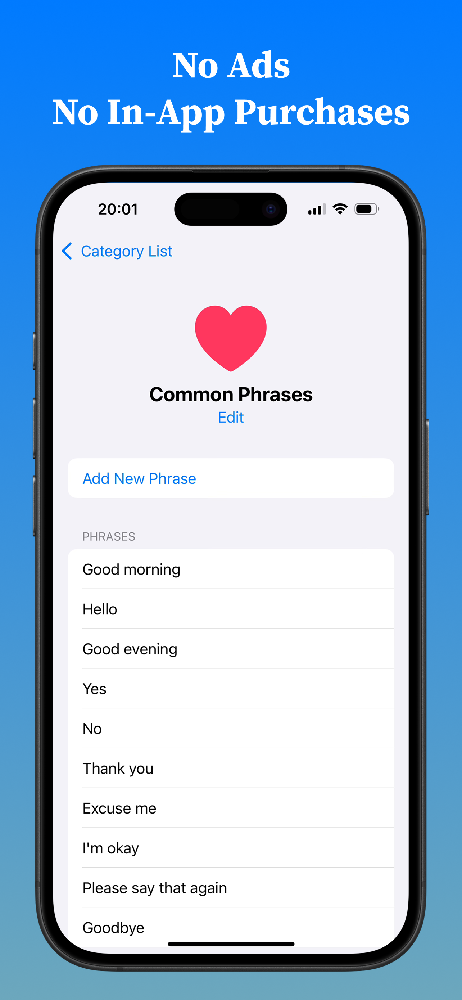

# Talk Assistant

Talk Assistant is a text-to-speech app designed to support smooth communication for people with speech impairments or in situations where speaking is difficult.

Available on the [App Store](https://apps.apple.com/us/app/talk-assistant/id6736892711)

Main Features:
- Enter text and read out loud
- Create categories to organize and save frequently used phrases
- Switch voices and freely adjust pitch and speed

||||
|---|---|---|

# Requirements
- Swift 6.0+
- Xcode 16.0+
- iOS 17.0+

# Installation
```
git clone git@github.com:haludoll/talk-assistant.git
cd talk-assistant
open talk-assistant.xcworkspace
```

## Technical Overview
- UI framework: SwiftUI
- Asynchronous programming: async/await with Swift Concurrency
- Architecture: Domain-driven package contexts with layered MVVM modules (see [docs/ARCHITECTURE.md](docs/ARCHITECTURE.md))
- Dependency injection: [`swift-dependencies`](https://github.com/pointfreeco/swift-dependencies)
- Database: SwiftData
- Testing: Swift Testing, XCTest
- Analytics and logging: Firebase Analytics, Crashlytics
- Other libraries: AVFoundation, [`swift-async-algorithms`](https://github.com/apple/swift-async-algorithms)
- Localization: English (main), Japanese
- CI/CD: Xcode Cloud (Pull Request, Deploy, Release workflows)
